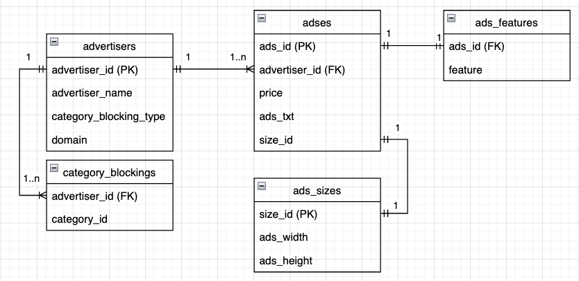

# DB 構成

DB のデータセット名は `geniee` です。

カッコ内は DB のテーブル/カラム名、矢印は外部キー (参照先) です。 `:` 以降はコメントです。PK がついているカラムは(複合)主キーです。

- 広告主 ( `advertisers` )

  - 広告主 ID ( `advertiser_id` ) (PK)
  - 広告主名 ( `advertiser_name` )
  - カテゴリブロッキングタイプ ( `category_blocking_type` ) : 広告主が持っている `category_id` を用いてどのように広告をブロックするかを制御します。
  - 広告主ドメイン(`domain`) : リクエストに付属する文字列とともに配信制御に使われます。

- 広告サイズテーブル ( `ads_sizes` )

  - 広告サイズ ID( `size_id` ) (PK)
  - 広告横幅 ( `ads_width` )
  - 広告縦幅 ( `ads_height` )

- 広告テーブル ( `adses` )

  - 広告 ID ( `ads_id` ) (PK)
  - 広告主 ID ( `advertiser_id` ) -> ( `advertisers.advertiser_id` )
  - 価格 ( `price` ) : 広告の価格です。
  - 案件 text ( `ads_txt` ) : 広告本体です。今回は文字列として扱っています。
  - サイズ ID ( `size_id` ) -> ( `ads_sizes.size_id` )

- カテゴリブロッキング ( `category_blockings` )

  - 広告主 ID ( `advertiser_id` ) (PK) -> ( `advertisers.advertiser_id` )
  - カテゴリ ID ( `category_id` ) (PK) : 配信制御に用いるカテゴリです。リクエストに付与されているカテゴリと一致しているものがある時、広告を配信するかどうかを決めます。

- 広告特徴量 ( `ads_features` )
  - 案件 ID ( `ads_id` ) (PK) -> ( `adses.ads_id` )
  - 一次元特徴量 ( `feature` ) : 広告に付与されている特徴量です。

---

## ER 図



---

## 制約

DB に格納されているデータについては以下が守られています。
| カラム名 | 条件 |
| ------ | ---- |
| `advertiser_id` , `ads_id` | 1 以上の整数です。32bit 符号つき整数で表現できることが約束されています。 |
| `size_id` | 1 ~ 4 の整数です。  |
| `ads_width` , `ads_height` | 1 ~ 999 の整数です。 |
| `category_id` | 1 ~ 20 の整数です。 |
| `category_blocking_type` | 0 か 1 を取ります。0 が許可を、1 は拒否を表しています。 |
| `domain` | 英大文字小文字数字からなる32文字の文字列に末尾に`.com`が付属される文字列です。 |
| `advertiser_name` , `ads_txt` | 英大文字小文字数字からなる文字列です。それぞれ 16 文字、64 文字です。 |
| `price` | -10 ~ 10 までの小数です。整数とは限らず、小数第 4 位まで与えられます。 |
| `feature` | -100000 ~ 100000 の整数です。 |

---

## 具体例

[`./sql/data.sql`](../sql/data.sql) にサンプルデータが保存されています。

```sql

INSERT INTO `advertisers` (`advertiser_id`, `advertiser_name`, `category_blocking_type`, `domain`)
VALUES (1, "test_advertiser", 0, "K789YZWFinalCodeXYZ000CXYZ456YZ0.com");

INSERT INTO `ads_sizes` (`size_id`, `ads_width`, `ads_height`)
VALUES (1, 200, 300);

INSERT INTO `adses` (`ads_id`, `advertiser_id`, `price`, `ads_txt`, `size_id`)
VALUES (1, 1, 102.45, "test_ads", 1);

INSERT INTO `category_blocking` (`advertiser_id`, `category_id`)
VALUES (1, 4), (1, 10);

INSERT INTO `ads_features` (`ads_id`, `feature`)
VALUES (1, 41);
```

- `advertisers` には広告主の情報として、広告主 ID 、 広告主名、カテゴリブロック配信制御情報、広告主ドメイン が入っています。
- `ads_sizes`　には広告サイズの情報として、広告サイズ ID 、広告横幅、広告縦幅の情報が入っています。
- `adses` には広告の情報として、広告 ID 、広告を所持している広告主 ID 、広告の価格、広告の文字、広告サイズ ID が入っています。
- `category_blocking` には広告主が配信制御したいカテゴリ ID 一覧が登録されています。複数のカテゴリが同一広告主に登録されることがあります。
- `ads_features` には広告に付与されている特徴量が保存されています。一次元の特徴量なので `ads_id` が主キーになります。
