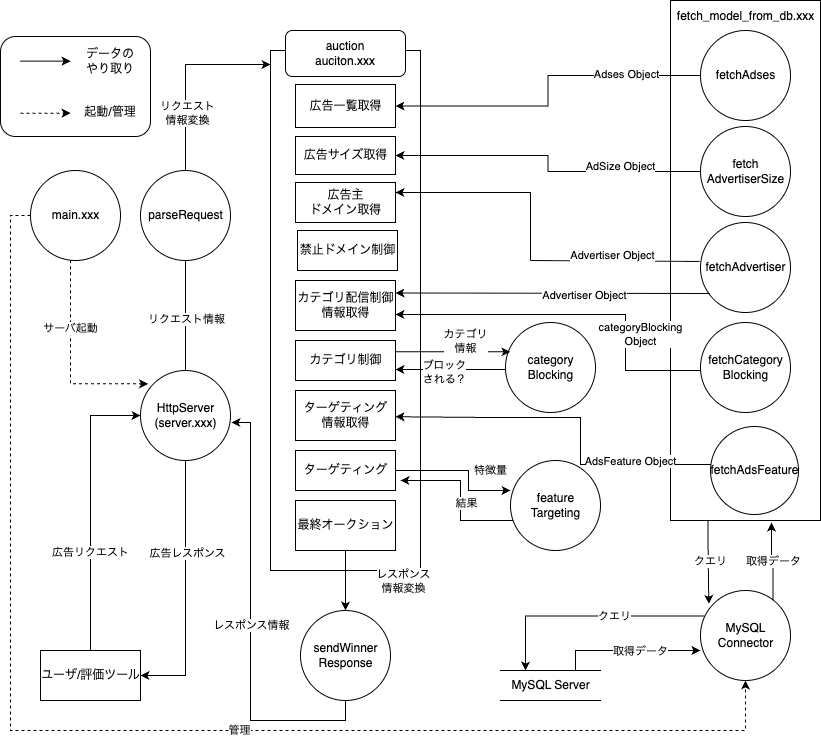

# ソースファイル詳細

言語によって多少の差異/表記揺れはあるものの、ベースは同じになるように記述しております。

メイン処理は `auction` 関数ですのでそちらから理解を進めることを推奨します。

`auctionHandler` はリクエスト/レスポンス形式を扱いやすい形に変換してサーバとやり取りするラッパー関数としての役割があります。

`.xxx` は適宜拡張子をお使いの言語に置き換えてください。

## 呼び出し階層

1. `main.xxx` はまずサーバと `MySQLConnector` を初期化し、管理します
1. ユーザがサーバにリクエストを飛ばすと、サーバーは `MySQLConnector` と共に `auction` を呼び出します
1. `auction` に渡すリクエスト情報は扱いにくいので、 `parseRequest` を呼び出して `Request` クラスに変換します
1. 広告一覧 `adses` を DB 経由で取得します
1. 要求広告サイズ( `zone_width` 、 `zone_height` )と広告サイズ( `ads_width` 、 `ads_height` )が等しい広告のみを全広告データから抽出します
1. 禁止ドメイン制御を行います
   1. 広告から広告主ドメイン(`domain`)をDB経由で取得します
   1. リクエスト中に含まれる禁止するドメイン達(`block_domains`)の文字列が、広告主ドメイン中に少なくとも一つ含まれていれば、その広告をブロックします
1. 各広告に対してカテゴリ制御を適用します
   1. 広告を所持している広告主情報 `advertiser` を DB 経由で取得します
   1. カテゴリ制御を決定するカテゴリ情報 `categoryBlocking` を DB 経由で取得します
   1. カテゴリ制御を適用し、広告配信できるカテゴリかをチェックします
1. 配信できる広告を所持している広告主が持っている広告リストについてターゲティングを行います
   1. 広告特徴量 `adsFeature` を DB 経由で取得します
   1. ターゲティングを行い、リクエストの特徴量と近い広告を取得します
1. 配信候補となる広告の中で価格が最も高いものを計算
1. レスポンスフォーマットや方法が特殊なので `sendWinnerResponse` を実行し呼び出し側に結果を返却します

---

## 各種ファイル

すでに書かれているファイル詳細です。  
高速化にあたって自由にファイルを追加/削除して構いません。

### main.xxx

起動に必要なサーバセットアップや全体で使い回す変数を定義してサーバに渡しています。

### model/

DB のデータを保存したり、外部ライブラリに依存しているやり取りの間を取り持つ役割を持ちます。  
各依存ライブラリはこちらのモデルクラスを受け取ったり/返したりし、外部ライブラリの依存を減らすことが目的です。

#### advertiser.xxx

広告主情報が保存されています。カテゴリを許可/拒否するかどうかの情報 ( `category_blocking_type` ) もこちらに保存されています。

#### ads_size.xxx

広告サイズ情報が保存されています。

#### ads.xxx

広告案件が保存されています。

#### category_blocking.xxx

広告主が配信許可/拒否するカテゴリが保存されています。

#### ads_feature.xxx

広告案件ごとの特徴量が保存されています。

### request.xxx

SSP から送られてくるリクエスト情報から必要なものを取り出して保存しています。

#### response.xxx

SSP へ返す情報を保存するモデルです。

### connector/

MySQL サーバに接続しモデルクラスに詰めたデータを取得する役割を持ちます。

#### mysql_connector.xxx

MySQL サーバに接続してクエリを実行します。データを取得できるモデルを返します。このモデル経由でデータを取得します。

#### fetch_model_from_db.xxx

MySQL サーバからデータを取得し、モデルに保存する関数が定義されています。

### blocking/

#### category_blocking.xxx

カテゴリの配信許可/拒否ロジックが記述されています。詳しくは[仕様](./category-blocking.md)を確認してください。

### targeting/

#### faeture_matching.xxx

広告の特徴量マッチングロジックが記述されています。詳しくは[仕様](./feature-targeting.md)を確認してください。

### server/

http サーバやそれに伴うリクエスト/レスポンスを扱いやすい自作クラスに変換する役割を担います。また、エンドポイントなどメインの処理が記述されています。

#### auction.xxx

エンドポイントの処理が記述されています。メイン処理です。

#### server.xxx

http サーバを記述。内部で複数スレッド立ち上げもよろしく面倒を見ます。

#### request_parser.xxx

外部ライブラリ (libevent) の request クラスを、必要な情報だけが格納された自作の request クラスに変換します。

#### response_builder.xxx

自作の response クラスを用いて、外部ライブラリがよしなに response を構築するためのクラスです。

### config/

#### config.xxx

設定条件が記述されています。
