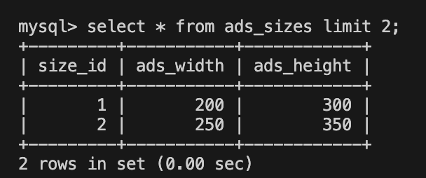

# サイズ抽出

各広告は大きさを表す ( `size_id` ) を所持しています。  
これは `ads_sizes` テーブルのキー `size_id` に紐づいており、 `ads_sizes` テーブルには `ads_width` 、 `ads_height` があります。

ある広告が持つ `ads_width` 、 `ads_height` がリクエストに含まれている `zone_width` 、 `zone_height` とそれぞれ合致している場合には、その広告は次の処理に進むことができます。  
合致していない場合は次の処理に進めません。

---

## 具体例

- パターン 1.

要求広告サイズ `(zone_width, zone_height) = (200, 300)`

ある広告がもつ `size_id` が `size_id = 1` の場合、 `ads_sizes` テーブルを見ると横幅と縦幅がともに一致します。この広告は選ばれる候補となり得ます。

- パターン 2.

要求広告サイズ `(zone_width, zone_height) = (250, 350)`

ある広告がもつ `size_id` が `size_id = 2` の場合、 `ads_sizes` テーブルを見ると横幅も縦幅も一致しません。この広告は選ばれる候補となり得ません。
